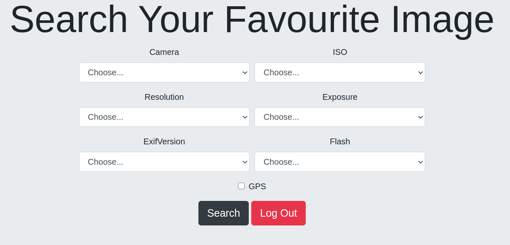

## How to use this image


download the code

```console
$ git clone https://github.com/justinepdevasia/metadata-image-search.git
$ cd metadata-image-search
$ npm install

```

You can run using Docker Compose:

```console
$ docker-compose up -d
```




